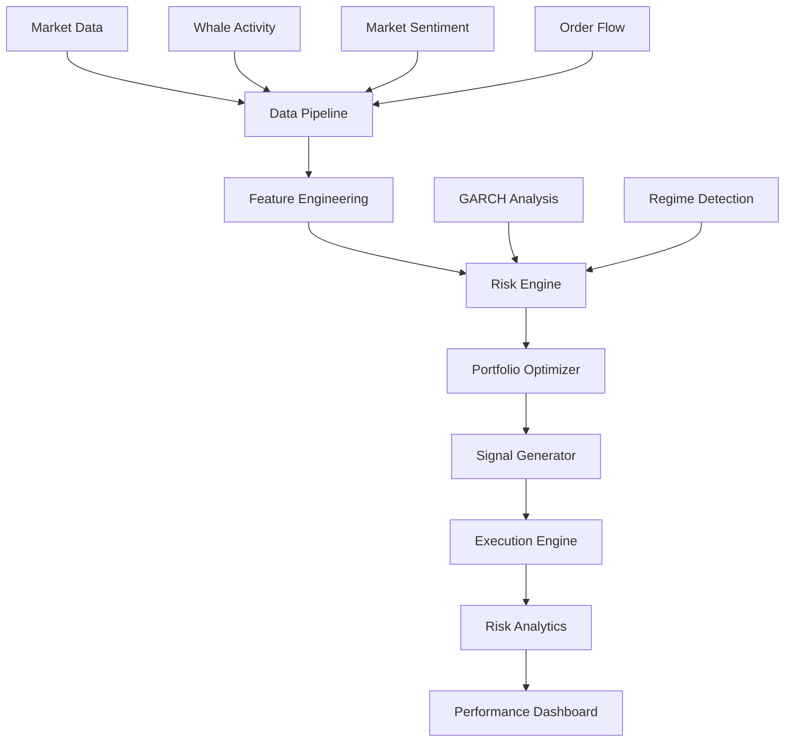

# Crypto Trading System - Advanced Market Analysis Framework
[](https://www.python.org/downloads/)
[](LICENSE)
[](src/analysis/garch.py)
[](src/analysis/regime.py)

A sophisticated cryptocurrency trading system combining advanced volatility modeling, regime detection, and smart order execution. Built for 24/7 markets with specific adaptations for cryptocurrency dynamics.

## 🚀 Overview

This framework provides a comprehensive solution for cryptocurrency trading by combining state-of-the-art quantitative methods:

- **🤖 Advanced Analytics**: 
  - Crypto-adapted GARCH modeling
  - Dynamic regime detection
  - Multi-factor signal generation
  - Real-time market state analysis

- **⚡ Risk Management**: 
  - Volatility-based position sizing
  - Dynamic risk thresholds
  - Regime-aware exposure control
  - Extreme event handling

- **📊 Market Microstructure**:
  - 24/7 market adaptations
  - Liquidity analysis
  - Volume profile analysis
  - Whale activity monitoring

## 🏗️ Architecture



## 🔧 Core Components

### 1. Crypto-Adapted GARCH

### 2. Dynamic Regime Detection

### 3. Signal Generation


## 📈 Key Features

### Volatility Analysis
- EGARCH modeling for asymmetric volatility
- Adaptive outlier detection
- Regime-specific volatility forecasting
- Extreme event handling

### Risk Management
- Dynamic position sizing
- Regime-based exposure limits
- Volatility-adjusted stop losses
- Portfolio concentration limits

### Market Analysis
- Multi-timeframe analysis
- Volume profile integration
- Whale activity monitoring
- Market sentiment analysis

## 📦 Installation
```bash
# Create virtual environment
python -m venv venv

# Activate environment
source venv/bin/activate  # Unix/macOS
.\venv\Scripts\activate  # Windows

# Install dependencies
pip install -r requirements.txt
```
### Prerequisites
- Python 3.8+
- Virtual environment (recommended)
## 🤝 Contributing (only for authorised users)

### Development Workflow
1. Fork the repository
2. Create a feature branch
3. Install development dependencies
4. Run tests and linting
5. Submit pull request

### Code Standards
- Follow PEP 8 guidelines
- Include comprehensive docstrings
- Add unit tests for new features
- Use type hints consistently

## 🔬 Mathematical Foundation

### GARCH Volatility
$$\sigma_t^2 = \omega + \alpha\epsilon_{t-1}^2 + \beta\sigma_{t-1}^2$$

### Regime Detection
$$P(S_t = j|S_{t-1} = i) = p_{ij}$$

### Signal Generation
$$Signal = w_1f_{trend} + w_2f_{vol} + w_3f_{sent}$$

## 📚 References

### Academic Literature


### Resources


## 📄 License

Commercial Software License
Copyright (c) 2024

**All Rights Reserved**

For licensing inquiries:
- Email: contact@lucaskemper.com

---
**Note**: This system is under active development. Features and documentation are updated frequently.
