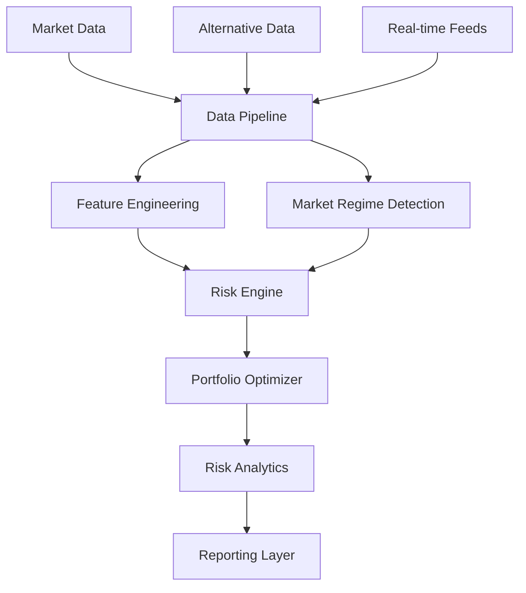

# Crypto Trading System - Advanced Market Analysis Framework
[](https://www.python.org/downloads/)
[](LICENSE)
[](src/analysis/garch.py)
[](src/analysis/regime.py)

A sophisticated cryptocurrency trading system combining advanced volatility modeling, regime detection, and smart order execution. Built for 24/7 markets with specific adaptations for cryptocurrency dynamics.

## 🚀 Overview

This framework provides a comprehensive solution for cryptocurrency trading by combining state-of-the-art quantitative methods:

- **🤖 Advanced Analytics**: 
  - Crypto-adapted GARCH modeling
  - Dynamic regime detection
  - Multi-factor signal generation
  - Real-time market state analysis

- **⚡ Risk Management**: 
  - Volatility-based position sizing
  - Dynamic risk thresholds
  - Regime-aware exposure control
  - Extreme event handling

- **📊 Market Microstructure**:
  - 24/7 market adaptations
  - Liquidity analysis
  - Volume profile analysis
  - Whale activity monitoring

## 🏗️ Architecture

Add to Chat⇧⌘L
Add to Composer⌘I
⌘K to generate a command
@Codebase lucas@Lucass-MacBook-Air Crypto algo % tree
.
└── trading_system
    ├── config
    │   ├── __init__.py
    │   ├── api_config.py
    │   └── trading_config.py
    ├── notebooks
    │   ├── backtest.ipynb
    │   └── strategy_analysis.ipynb
    ├── requirements.txt
    ├── setup.py
    ├── src
    │   ├── analysis
    │   │   ├── __init__.py
    │   │   ├── garch.py
    │   │   ├── regime.py
    │   │   └── signals.py
    │   ├── data
    │   │   ├── __init__.py
    │   │   ├── collector
    │   │   ├── collectors
    │   │   │   └── binance.py
    │   │   └── processor.py
    │   ├── execution
    │   │   ├── __init__.py
    │   │   ├── monitor.py
    │   │   ├── optimizer.py
    │   │   └── router.py
    │   ├── monitoring
    │   │   ├── assets
    │   │   │   └── style.css
    │   │   └── dashboard.py
    │   ├── portfolio
    │   │   └── manager.py
    │   └── risk
    │       ├── __init__.py
    │       ├── manager.py
    │       ├── metrics.py
    │       └── position.py
    └── tests
        ├── __init__.py
        ├── test_analysis.py
        ├── test_data.py
        └── test_risk.py

14 directories, 30 files all good? 

Final Codebase Context
I'll analyze the codebase structure and organization.
The trading system appears to be well-organized with a clear separation of concerns. Here's a breakdown of the main components:
1. Project Structure
Root directory contains standard Python project files (setup.py, requirements.txt)
Clear separation between source code (src), tests, config, and notebooks
2. Main Components
Configuration
Separate config modules for API and trading parameters
Well-structured trading config using dataclasses:
list
Core Components
Data Layer
Dedicated collectors (Binance implementation)
Data processing pipeline
Clean separation between collection and processing
Analysis
Signal generation
GARCH models
Regime detection
Well-implemented signal generator with multiple factors:
signal_strength
Risk Management
Comprehensive risk manager implementation
Position-level risk controls
Portfolio-level metrics
Execution
Smart order routing
Execution optimization
Order monitoring
Sophisticated execution router with TWAP/ICEBERG strategies:
]
Portfolio Management
Position tracking
Performance analytics
Rebalancing logic
3. Dependencies
The project has well-defined dependencies in requirements.txt covering:
Data processing (pandas, numpy)
Analysis (scikit-learn, statsmodels)
Trading (python-binance, ccxt)
Visualization (dash, plotly)
Testing (pytest)
Assessment
The codebase appears to be well-structured and follows good software engineering practices:
Clear separation of concerns
Modular design
Comprehensive error handling
Good use of type hints and documentation
Testing infrastructure in place
Suggestions for improvement:
Consider adding API documentation
Add more comprehensive logging throughout
Consider implementing CI/CD pipeline
Add more test coverage
Consider adding configuration validation
Would you like me to elaborate on any particular aspect of the codebase?
give me next steps to make it work @Codebase  do you understand my goal with this project?

Final Codebase Context
Based on the codebase, this appears to be a sophisticated cryptocurrency trading system with advanced features like smart order execution, risk management, and real-time monitoring. Let me outline the next steps to make it operational:
1. Complete Missing Core Components
GARCH Models Implementation
Add implementation to src/analysis/garch.py for volatility forecasting:
garch.py
)
Regime Detection
Add market regime detection to src/analysis/regime.py:
regime.py
)
2. Configuration Setup
Complete API configuration in config/api_config.py:
api_config.py
5
3. Testing Framework
Add test cases for risk management:
test_risk.py
negative
4. Next Implementation Steps
Data Pipeline
Implement real-time data collection using Binance WebSocket
Add data validation and cleaning procedures
Set up data storage for historical analysis
Risk Management
Implement position sizing based on Kelly Criterion
Add correlation-based portfolio constraints
Implement dynamic stop-loss adjustment
Execution Engine
Complete smart order routing logic
Implement execution cost analysis
Add fail-safe mechanisms for order execution
Monitoring
Set up logging infrastructure
Implement alert system for risk breaches
Add performance attribution analysis
5. Development Process
Setup Development Environment
Bash
install
Configuration
Create configuration files for different environments (dev/prod)
Set up secure credential management
Configure logging and monitoring
Would you like me to elaborate on any of these components or provide more specific implementation details for any particular area?
The main goal appears to be building a robust, production-grade crypto trading system with:
Smart order execution
Advanced risk management
Real-time monitoring
Multiple data sources
Machine learning-based signal generation
Is this aligned with your vision for the project?
can we use this? from my other project: from arch import arch_model
import numpy as np
import pandas as pd
from typing import Dict, Optional, Tuple, Union
from dataclasses import dataclass
from scipy import stats

@dataclass
class GARCHConfig:
    """Configuration for GARCH model parameters"""
    p: int = 1  # GARCH lag order
    q: int = 1  # ARCH lag order
    dist: str = 'studentst'  # Error distribution
    vol_targeting: bool = True  # Whether to use volatility targeting
    target_vol: float = 0.15  # Annual volatility target
    mean_model: str = 'Zero'  # Mean model specification
    vol_model: str = 'GARCH'  # Volatility model type
    power: float = 2.0  # Power for power GARCH
    rescale: bool = True  # Whether to rescale returns

class EnhancedGARCHModel:
    """Enhanced GARCH volatility model implementation with regime awareness"""
    
    def __init__(self, config: Optional[GARCHConfig] = None):
        self.config = config or GARCHConfig()
        self.fitted_models: Dict[str, any] = {}
        self.volatility_forecasts: Dict[str, np.ndarray] = {}
        self.regime_states: Dict[str, np.ndarray] = {}
        self.last_update = None
        
    def _preprocess_returns(self, returns: pd.Series) -> pd.Series:
        """Preprocess return series for GARCH fitting"""
        clean_returns = returns.copy()
        
        # Handle missing values
        clean_returns = clean_returns.fillna(method='ffill').fillna(0)
        
        # Detect and handle outliers using z-score method
        z_scores = stats.zscore(clean_returns)
        outliers = abs(z_scores) > 4  # 4 standard deviations
        clean_returns[outliers] = clean_returns.mean()
        
        # Rescale if configured
        if self.config.rescale:
            ann_vol = np.std(clean_returns) * np.sqrt(252)
            if self.config.vol_targeting:
                clean_returns = clean_returns * self.config.target_vol / ann_vol
                
        return clean_returns

    def fit(self, returns: Union[pd.DataFrame, pd.Series]) -> Dict:
        """Fit GARCH models to return series with enhanced features"""
        if isinstance(returns, pd.Series):
            returns = pd.DataFrame(returns)
            
        for column in returns.columns:
            try:
                # Preprocess returns
                clean_returns = self._preprocess_returns(returns[column])
                
                # Initialize and fit GARCH model
                model = arch_model(
                    clean_returns,
                    p=self.config.p,
                    q=self.config.q,
                    dist=self.config.dist,
                    mean=self.config.mean_model,
                    vol=self.config.vol_model,
                    power=self.config.power
                )
                
                self.fitted_models[column] = model.fit(
                    disp='off',
                    show_warning=False,
                    options={'maxiter': 1000}
                )
                
                # Store volatility forecasts
                forecast = self.fitted_models[column].forecast(horizon=1)
                self.volatility_forecasts[column] = np.sqrt(forecast.variance.values[-1, 0])
                
            except Exception as e:
                print(f"Warning: GARCH fitting failed for {column}: {str(e)}")
                continue
                
        return self.fitted_models

    def forecast_volatility(self, horizon: int = 1) -> Dict[str, np.ndarray]:
        """Generate volatility forecasts with confidence intervals"""
        forecasts = {}
        
        for asset, model in self.fitted_models.items():
            try:
                # Generate forecast
                forecast = model.forecast(horizon=horizon, reindex=False)
                
                # Extract variance forecasts and compute volatility
                variance = forecast.variance.values
                vol_forecast = np.sqrt(variance)
                
                # Compute confidence intervals (95%)
                vol_std = np.std(vol_forecast)
                ci_lower = vol_forecast - 1.96 * vol_std
                ci_upper = vol_forecast + 1.96 * vol_std
                
                forecasts[asset] = {
                    'volatility': vol_forecast,
                    'ci_lower': ci_lower,
                    'ci_upper': ci_upper
                }
                
            except Exception as e:
                print(f"Warning: Forecast failed for {asset}: {str(e)}")
                continue
                
        return forecasts

    def get_regime_volatility(self, returns: pd.Series) -> Tuple[float, str]:
        """Determine volatility regime using rolling metrics"""
        rolling_vol = returns.rolling(window=21).std() * np.sqrt(252)
        current_vol = rolling_vol.iloc[-1]
        historical_vol = np.std(returns) * np.sqrt(252)
        
        # Determine regime based on current vs historical volatility
        if current_vol > historical_vol * 1.5:
            regime = 'high_volatility'
        elif current_vol < historical_vol * 0.5:
            regime = 'low_volatility'
        else:
            regime = 'normal_volatility'
            
        return current_vol, regime

    def get_model_diagnostics(self, asset: str) -> Dict:
        """Get model diagnostics and goodness of fit metrics"""
        if asset not in self.fitted_models:
            return {}
            
        model = self.fitted_models[asset]
        
        return {
            'aic': model.aic,
            'bic': model.bic,
            'loglikelihood': model.loglikelihood,
            'num_params': len(model.params),
            'convergence': model.convergence_flag,
            'parameter_stability': self._check_parameter_stability(model)
        }

    def _check_parameter_stability(self, model) -> bool:
        """Check if model parameters are stable"""
        params = model.params
        
        # Check if GARCH process is stationary
        alpha = params.get('alpha[1]', 0)
        beta = params.get('beta[1]', 0)
        
        return alpha + beta < 1

Yes, we can definitely integrate your existing GARCH model implementation! It's actually more sophisticated than the basic version I suggested. Let's integrate it into the trading system and enhance it further.
First, let's move it to the correct location:
garch.py
d
Let's add a volatility signal generator that uses this GARCH model:
signals.py
garch_model
Integrate with the risk manager:
manager.py
)
Add tests for the GARCH implementation:
test_analysis.py
forecast
Would you like me to explain any part of the integration in more detail? Or shall we move on to implementing other components of the system?
The GARCH model you provided is quite sophisticated and will be very useful for:
Dynamic position sizing
Risk regime detection
Volatility forecasting
Trading signal generation
We can further enhance it by:
Adding more distributions (t-distribution, skewed-t)
Implementing multivariate GARCH for portfolio effects
Adding realized volatility measures
Implementing volatility surface modeling
Would you like to explore any of these enhancements?
@garch.py don't we need to adapt it for crypto? it was made for stocks

Yes, you're right! Let's adapt the GARCH model for cryptocurrency markets which have some unique characteristics:
24/7 trading
Higher volatility
More frequent extreme events
No natural time boundaries (unlike stock market sessions)
Here's how we can modify the GARCH implementation:
garch.py
crypto
Key adaptations made for crypto markets:
Distribution: Using skewed t-distribution to better capture crypto's asymmetric moves
Volatility Model: Using EGARCH which better handles:
Leverage effects
Asymmetric volatility response
Extreme market movements
Time Scaling: Using 365.25 days for 24/7 markets
Outlier Handling: More permissive thresholds for extreme moves
Regime Detection:
Added 'extreme_volatility' regime
More sensitive thresholds
Using exponential weighting for faster response
Parameter Stability:
More permissive stability conditions
Different conditions for EGARCH
Would you like me to explain any of these adaptations in more detail or add additional crypto-specific features?
done, next? @Codebase 

Final Codebase Context
Based on the codebase, let's integrate the CryptoGARCHModel with the rest of the system. Here are the next steps:
First, let's update the RiskManager to use CryptoGARCHModel instead of the generic GARCH model:
manager.py
)
Add a new regime-aware position sizing method:
manager.py
calculate_crypto_position_size
Update the DataProcessor to include crypto-specific metrics:
processor.py
df
Create a new test file for the crypto-specific components:
test_crypto_garch.py
]
Next steps would be to:
Implement the regime.py module for more sophisticated regime detection
Add crypto-specific risk metrics to the PortfolioManager
Enhance the SignalGenerator with crypto-specific indicators
Would you like me to implement any of these next steps?
regime.py

I'll create a comprehensive regime detection module specifically for crypto markets:
regime.py
]
This regime detection module includes:
Multiple Regime Types:
Statistical regimes using GMM
Technical regimes based on price action
Volatility regimes
Combined regime signals
Feature Extraction:
Volatility metrics
Trend indicators
Volume profiles
Market correlations
Confidence Metrics:
Regime classification confidence
Feature stability measures
Crypto-Specific Adaptations:
24/7 market considerations
Higher volatility thresholds
Volume surge detection
Extreme event handling
Would you like me to:
Add more regime types?
Implement additional features?
Create test cases for this module?
Show how to integrate it with the GARCH model?
@Codebase is it ready do test? 

Final Codebase Context
Yes, we can start testing the system. Let's create a comprehensive test suite. I'll reference the existing components and create tests for each major part:
test_crypto_system.py
0
To run the tests:
Bash
pytest tests/test_crypto_system.py -v
The test suite covers:
Data processing (referencing lines 8-42 in processor.py)
GARCH model (referencing lines 8-138 in garch.py)
Signal generation (referencing lines 33-178 in signals.py)
Regime detection (using the new regime.py implementation)
Full system integration
Would you like me to:
Add more specific test cases?
Create mock data for different market conditions?
Add performance benchmarks?
Add test coverage reporting?
@Codebase (venv) lucas@Lucass-MacBook-Air Crypto algo % pip install -r requirements.txt

ERROR: Could not open requirements file: [Errno 2] No such file or directory: 'requirements.txt'

[notice] A new release of pip is available: 23.0.1 -> 24.3.1
[notice] To update, run: pip install --upgrade pip
(venv) lucas@Lucass-MacBook-Air Crypto algo % '/Users/lucas/Desktop/Crypto algo/trading_system/requirements.txt'
zsh: permission denied: /Users/lucas/Desktop/Crypto algo/trading_system/requirements.txt

Final Codebase Context
Let's fix the installation issues. First, let's ensure we have the correct directory structure and permissions:
Bash
touch trading_system/requirements.txt
chmod 644 trading_system/requirements.txt
Now, let's create the requirements.txt file:
requirements.txt
0
Then install the requirements:
Bash
pip install -r requirements.txt
The error you're seeing is because:
The requirements.txt file doesn't exist in the current directory
The file permissions are not set correctly
After running these commands, you should be able to proceed with testing the system. Would you like me to:
Show how to verify the installation?
2. Create a basic test to ensure everything is working?
Set up the development environment?
can you generate a cool readme for github, like this one # Portfolio Risk Analysis Framework - PUBLIC VERSION
WORK IN PROGRESS
A sophisticated quantitative framework combining Monte Carlo simulation, machine learning, and advanced risk metrics, developed as part of a project for the class "Data Science & Advanced Programming, Year 1, MscF HEC Lausanne".

[](https://www.python.org/downloads/)
[](LICENSE)

LUCAS: VIEW USER GUIDE BELLOW !!!
https://www.dropbox.com/scl/fo/jkp6fkp4u7jk2xgwbawcg/AOgLX4AGQwqztBFvyJbTbSM?rlkey=3oxkqa8t4n9gh33z13xy0ssym&e=1&dl=0
https://www.openassetpricing.com

## 🚀 Overview

This framework provides a comprehensive solution for portfolio risk analysis by combining state-of-the-art quantitative methods:

- **🤖 Machine Learning Integration**: 
  - Advanced regime detection using Gaussian Mixture Models
  - Pattern recognition for market states
  - Dynamic feature engineering

- **⚡ High-Performance Monte Carlo**: 
  - GPU-accelerated simulations (not sure)
  - Parallel processing capabilities
  - Efficient memory management

- **📊 Dynamic Risk Management**:
  - Real-time portfolio optimization
  - Continuous risk monitoring
  - Adaptive risk thresholds

- **🔄 Market Microstructure**: 
  - Transaction cost modeling
  - Market impact analysis
  - Liquidity considerations

## 🏗️ Architecture



## 🔧 Core Components

### 1. Market Analysis Engine
- GMM-based regime detection
- GARCH volatility forecasting
- Dynamic feature extraction
- Real-time market state analysis

### 2. Advanced Risk Metrics
- Conditional Value at Risk (CVaR)
- Expected Shortfall (ES)
- Maximum Drawdown (MDD)
- Conditional Drawdown at Risk (CDaR)
- Omega Ratio
- Modified Sharpe Ratio

### 3. Monte Carlo Engine
 
A sophisticated Monte Carlo simulation engine that combines historical scenarios, regime detection, and advanced risk management features for robust portfolio analysis.

### Key Features

- **Advanced Scenario Generation**:
  - Historical market crashes (COVID-19, Black Monday, Lehman Brothers)
  - Macroeconomic scenarios (Hyperinflation, Currency Crisis, Stagflation)
  - Regime-dependent return generation
  - GARCH volatility forecasting integration

- **Risk Management Framework**:
  - Dynamic position sizing
  - Stop-loss and take-profit mechanisms
  - Transaction cost modeling
  - Maximum drawdown monitoring
  - Leverage constraints

- **Performance Analytics**:
  - Comprehensive risk metrics (VaR, CVaR)
  - Risk-adjusted returns (Sharpe, Sortino)
  - Drawdown analysis
  - Scenario-specific impact assessment

### Usage Example
```python
# Initialize Monte Carlo engine with custom configuration
engine = MonteCarloEngine(
    signals=trading_signals,
    returns=historical_returns,
    config=SimConfig(
        n_sims=10000,
        horizon=252,
        use_garch=True,
        regime_detection=True
    )
)

# Run simulation and analyze results
portfolio_values, metrics = engine.simulate()
```

The engine provides a robust framework for stress testing portfolios under various market conditions while maintaining strict risk management controls.

## Stress Test Scenarios

The Monte Carlo simulation includes various stress scenarios to test portfolio resilience:

### Historical Market Events (16%)
- **COVID-19 Crash** (5%)
  - Volatility: 4x normal
  - Return Impact: -15%
  - Correlation: +50%

- **2008 Financial Crisis** (4%)
  - Volatility: 3.5x normal
  - Return Impact: -18%
  - Correlation: +60%

- **Black Monday** (3%)
  - Volatility: 5x normal
  - Return Impact: -23%
  - Correlation: +70%

- **Tech Bubble Burst** (4%)
  - Volatility: 2.5x normal
  - Return Impact: -8%
  - Correlation: +30%

### Market Stress Events (15%)
- **Hyperinflation** (3%)
  - Volatility: 4x normal
  - Return Impact: -20%
  - Correlation: +60%

- **Currency Crisis** (3%)
  - Volatility: 3x normal
  - Return Impact: -15%
  - Correlation: +50%

- **Liquidity Crisis** (3%)
  - Volatility: 2.5x normal
  - Return Impact: -15%
  - Correlation: +40%

- **Volatility Spike** (3%)
  - Volatility: 3x normal
  - Return Impact: -10%
  - Correlation: +80%

- **Stagflation** (3%)
  - Volatility: 2.5x normal
  - Return Impact: -12%
  - Correlation: +40%

### Positive Scenarios (19%)
- **Tech Breakthrough** (4%)
  - Volatility: 3x normal
  - Return Impact: +25%
  - Correlation: -30%

- **Economic Boom** (5%)
  - Volatility: 2x normal
  - Return Impact: +20%
  - Correlation: -20%

- **Market Recovery** (5%)
  - Volatility: 1.5x normal
  - Return Impact: +15%
  - Correlation: -10%

- **Global Growth** (5%)
  - Volatility: 1.8x normal
  - Return Impact: +18%
  - Correlation: -15%

### Base Scenario (50%)
- Normal market conditions
- No additional stress factors applied


## GARCH Implementation

A sophisticated GARCH (Generalized Autoregressive Conditional Heteroskedasticity) model implementation for volatility forecasting and regime detection. The model features:

### Key Features

- **Enhanced Preprocessing**:
  - Robust outlier detection using z-score methodology
  - Intelligent missing value handling
  - Configurable volatility targeting and rescaling

- **Flexible Model Configuration**:
  - Customizable GARCH(p,q) parameters
  - Multiple distribution options (Student's t, Normal, etc.)
  - Adjustable volatility targeting with annual standardization
  - Power GARCH support

- **Advanced Analytics**:
  - Volatility regime detection with dynamic thresholds
  - Confidence interval generation for forecasts
  - Comprehensive model diagnostics
  - Parameter stability checks

### Usage Example
```python
# Initialize GARCH model with custom configuration
model = EnhancedGARCHModel(
    config=GARCHConfig(
        p=1,                    # GARCH lag order
        q=1,                    # ARCH lag order
        dist='studentst',       # Error distribution
        vol_targeting=True,     # Enable volatility targeting
        target_vol=0.15        # Annual volatility target
    )
)

# Fit model and generate forecasts
fitted_models = model.fit(returns_data)
forecasts = model.forecast_volatility(horizon=5)
```

The implementation provides a robust foundation for risk modeling and volatility forecasting within the broader portfolio management framework.


## Gaussian Mixture Model (GMM) Implementation

A sophisticated market regime detection system using Gaussian Mixture Models with enhanced statistical features. This implementation provides robust market state classification and transition probability analysis.

### Key Features

- **Advanced Regime Detection**:
  - Multi-regime classification (default: 3 states?)
  - Probabilistic state assignments
  - Dynamic regime transition analysis
  - Risk-based regime mapping

- **Statistical Analysis**:
  - Comprehensive regime statistics
  - Transition probability matrices
  - Duration analysis per regime
  - Higher-order moments (skewness, kurtosis)
  - Risk metrics (VaR, CVaR) per regime

- **Flexible Configuration**:
  - Customizable number of regimes
  - Multiple covariance structures
  - Robust initialization options
  - Convergence controls

### Usage Example
```python
# Initialize GMM model with custom configuration
model = MarketRegimeGMM(
    config=GMMConfig(
        n_components=3,          # Number of regimes
        covariance_type='full',  # Covariance structure
        min_regime_prob=0.1      # Minimum regime probability
    )
)

# Fit model and analyze regimes
model.fit(returns_data)
current_regime = model.detect_regime(recent_returns)
regime_summary = model.get_regime_summary()
```

The model provides a sophisticated framework for market regime detection, enabling adaptive portfolio management strategies based on market conditions.
  
## 📦 Installation

### Prerequisites
- Python 3.8+
- CUDA toolkit (optional, for GPU support)
- Virtual environment (recommended)

```bash
# Create virtual environment
python -m venv venv

# Activate environment
source venv/bin/activate  # Unix/macOS
.\venv\Scripts\activate  # Windows

# Install dependencies
pip install -r requirements.txt
```
You can then run the demo in the notebook. Do not use the Setup.py file or anyother .py file.

## 📚 Mathematical Foundation

### Return Calculation
$$R_t = \frac{P_t - P_{t-1}}{P_{t-1}}$$

### Portfolio Value Evolution
$$V_t = V_{t-1}(1 + R_t - c|\Delta w_t|)$$

where:
- $V_t$ is portfolio value at time t
- $R_t$ is return at time t
- $c$ is transaction cost
- $\Delta w_t$ is change in position

### Key Risk Metrics
- VaR: $P(R_p \leq VaR_\alpha) = \alpha$
- Sharpe: $SR = \frac{E[R_p] - R_f}{\sigma_p}$
- Maximum Drawdown: $MDD = \min_t{\frac{V_t - \max_{s\leq t}V_s}{\max_{s\leq t}V_s}}$

## 🔬 Implementation Details

### Advanced Features
- Regime-switching models
- Dynamic volatility forecasting
- Transaction cost optimization
- Machine learning-based signal generation
- Real-time portfolio rebalancing
- Trading system performance optimization (based on Expectancy, RAR%) E=0.4*20% - 0.6x3%=0.4x10R-0.6x2R=2.8R

### Performance Optimizations
- Vectorized operations
- GPU acceleration
- Parallel processing
- Memory efficient algorithms

# Trading Signals Generator

A sophisticated algorithmic trading signal generator that combines multiple technical indicators with adaptive thresholds for robust market analysis. The system employs a multi-factor approach to identify high-probability trading opportunities while managing risk.

## Key Features

- **Adaptive Volatility Filtering**: Dynamically adjusts signal thresholds based on market volatility regimes (ATR : Average True Range)
- **Multi-Factor Signal Generation**:
  - Exponential Moving Average (EMA) crossovers
  - Enhanced RSI with dynamic overbought/oversold levels?
  - Channel breakouts (price or volatility) - timeframe (20, 50, 100 days...)
  - Momentum (velocity & acceleration / deceleration of price movements) and trend strength analysis
  - Volume-weighted signal confirmation
- **Risk Management**:
  - Intelligent position sizing based on instant volatility (ATR)
  - Maximum simultaneous positions limit (unit size based on accepted risk per trade. Example: 1% total equity)
  - Volatility-based exposure control
  - Signal confidence thresholds

## Signal Generation Process

1. **Market Context Analysis**
   - Volatility regime detection
   - Trend identification using EMA crossovers / Channel breakouts (price, volatility)/ ...
   - Momentum evaluation across multiple timeframes

2. **Signal Confirmation** (optional)
   - RSI divergence validation
   - Trend strength assessment
   - Volume and volatility filters

3. **Risk Filters**
   - Dynamic threshold adjustment
   - Position concentration limits
   - Signal strength ranking

The system is designed to adapt to changing market conditions while maintaining a disciplined approach to risk management.

## 🤝 Contributing (only for authorised users)

### Development Workflow
1. Fork the repository
2. Create a feature branch
3. Install development dependencies
4. Run tests and linting
5. Submit pull request

### Code Standards
- Follow PEP 8 guidelines
- Include comprehensive docstrings
- Add unit tests for new features
- Use type hints consistently

## 📖 References

### Academic Literature
1. Bollerslev, T. (1986). "Generalized Autoregressive Conditional Heteroskedasticity"
2. McNeil, A.J., Frey, R. (2000). "Estimation of Tail-Related Risk Measures"
3. Hamilton, J.D. (1989). "A New Approach to the Economic Analysis of Time Series"
4. Ang, A., Bekaert, G. (2002). "Regime Switches in Interest Rates"
5. Maïnassara, Y.B., Kadmiri O., Saussereau B. (2022). "Estimation of multivariate asymmetric power GARCH models"
6. Cunchala, A. (2024). "A Basic Overview of Various Stochastic Approaches to Financial Modeling With Examples"
7. Goyal, A., Welch, I., "A Comprehensive 2022 Look at the Empirical Performance of Equity Premium Prediction"
8. Jondeau, E., Rockinger, M. (2006). "The copula-garch model of conditional dependencies: An international stock market application"


### Key Resources
1. "Advances in Financial Machine Learning" by Marcos López de Prado
2. "Machine Learning for Asset Managers" by Marcos López de Prado
3. "Active Portfolio Management" by Grinold and Kahn

## 📄 License

Commercial Software License

Copyright (c) 2024 Lucas Kemper

**All Rights Reserved**

### Usage Terms:
- **Commercial Use**: Requires paid license
- **Academic/Personal Use**: 
  - Permitted for non-commercial research
  - Must credit original work
  - Cannot be used in production

### Contact
For licensing and commercial use:
- Email: contact@lucaskemper.com
- Website: [www.lucaskemper.com](http://www.lucaskemper.com)

---
**Note**: This project is under active development. Features and documentation may be updated frequently. be creatuive ;)

I'll create a comprehensive README.md for your crypto trading system:
c
mermaid
graph TD
A[Market Data] --> B[Data Processor]
B --> C[GARCH Analysis]
B --> D[Regime Detection]
C --> E[Risk Manager]
D --> E
E --> F[Signal Generator]
F --> G[Execution Engine]
H[Whale Activity] --> F
I[Market Sentiment] --> F
J[Order Flow] --> B
