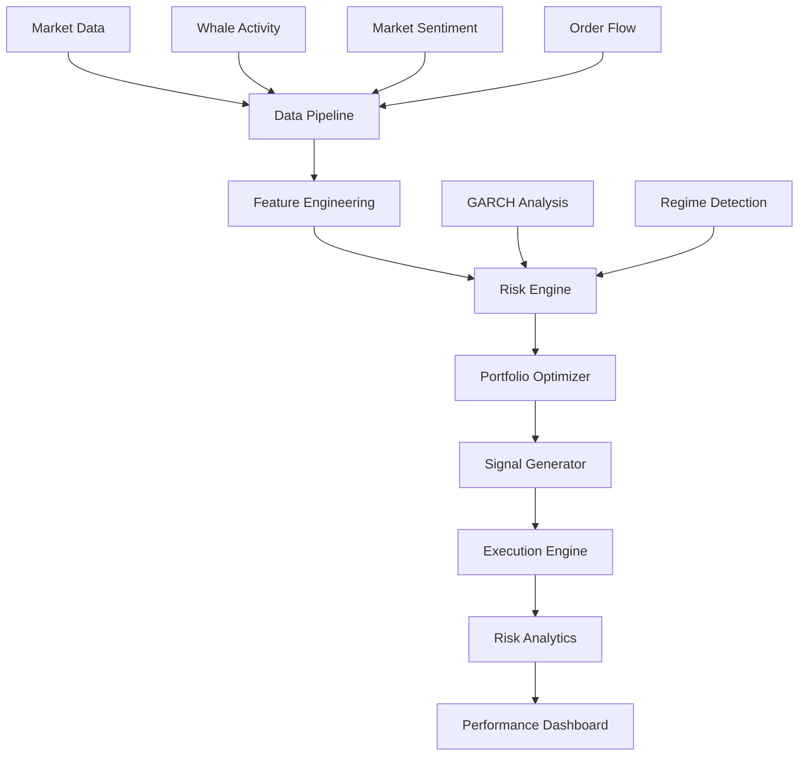

# 🚀 Cryptocurrency Trading System (Alpha Version)

[](https://www.python.org/downloads/)
[](LICENSE)
[](src/analysis/garch.py)
[](src/analysis/regime.py)

A sophisticated cryptocurrency trading system combining advanced volatility modeling, regime detection, and smart order execution. Built for 24/7 markets with specific adaptations for cryptocurrency dynamics.

## 🏗️ System Architecture



## Core Components

### 1. Data Pipeline
Advanced data processing pipeline for crypto markets:
```python
from datetime import datetime, timedelta
import yfinance as yf
import pandas as pd
from typing import Dict, Optional

class CryptoDataPipeline:
    def __init__(self, config: Optional[PipelineConfig] = None):
        self.config = config or PipelineConfig()
        self.processor = DataProcessor(self.config.processor_config)
        self.data: Dict[str, pd.DataFrame] = {}
```

### 2. GARCH Analysis
Crypto-adapted GARCH modeling with regime awareness:
```python
@dataclass
class CryptoGARCHConfig:
    p: int = 1
    q: int = 1
    dist: str = 'skewt'
    vol_targeting: bool = True
    target_vol: float = 0.50
    mean_model: str = 'Zero'
    vol_model: str = 'EGARCH'
    power: float = 2.0
```

### 3. Risk Management
Advanced risk controls with multi-factor analysis:
```python
class RiskManager:
    def check_trade(self, symbol: str, size: float, price: float, 
                   market_data: pd.DataFrame) -> Tuple[bool, Dict]:
        checks = {
            'size_check': self._check_position_size(size),
            'var_check': self._check_portfolio_var(symbol, size, market_data),
            'liquidity_check': self._check_liquidity(symbol, size, market_data),
            'concentration_check': self._check_concentration(symbol, size),
            'drawdown_check': self._check_drawdown()
        }
        return all(checks.values()), checks
```

## Configuration

### Trading Configuration
```yaml
# Trading pairs configuration
symbols:
  - BTC-USD
  - ETH-USD

# Timeframe settings
timeframes:
  - 1h
  - 4h

# Risk management parameters
max_position_size: 0.02
max_drawdown: 0.15
stop_loss: 0.02

# Exchange settings
primary_exchange: binance
```

## Installation

### Prerequisites
- Python 3.8+
- pip (Python package installer)

### Quick Start
```bash
# Clone repository
git clone <repository-url>
cd trading_system

# Create virtual environment
python -m venv venv
source venv/bin/activate # Unix/macOS
.\venv\Scripts\activate # Windows

# Install dependencies
pip install -r requirements.txt
```

### Development Setup
```bash
pip install -e ".[dev]"
```

### Dependencies

Core Dependencies:
- numpy>=1.20.0
- pandas>=1.3.0
- scipy>=1.7.0
- scikit-learn>=1.0.0
- matplotlib>=3.4.0
- seaborn>=0.11.0
- python-binance>=1.0.0
- arch>=4.19.0
- statsmodels>=0.13.0
- plotly>=5.0.0
- dash>=2.0.0

Development Tools:
- pytest>=7.0.0
- pytest-asyncio>=0.18.0
- pytest-mock>=3.7.0
- black>=22.0.0
- flake8>=4.0.0
- mypy>=0.800

## Testing Infrastructure

### Performance Testing
```python
def test_garch_performance(test_data):
    config = CryptoGARCHConfig(
        rescale=True,
        scale_factor=100.0,
        forecast_horizon=1,
        simulation_draws=1000
    )
    model = CryptoGARCHModel(config)
    results = run_performance_test(run_garch, test_data)
    assert results['execution_time'] < 5.0
    assert results['memory_used'] < 1024 * 1024 * 100
```

### Real Market Data Testing
```python
@pytest.fixture(scope="session")
def real_crypto_data():
    pairs = ['BTC-USD', 'ETH-USD', 'SOL-USD', 'DOGE-USD']
    end_date = datetime.now()
    start_date = end_date - timedelta(days=30)
    # Implementation details in tests/test_real_data.py
```

## Monitoring Dashboard
Real-time system monitoring with Dash:
```python
class TradingDashboard:
    def __init__(self, portfolio_manager, risk_manager, execution_router):
        self.app = dash.Dash(__name__)
        self.portfolio = portfolio_manager
        self.risk = risk_manager
        self.execution = execution_router
```

## Project Structure
```
src/
├── analysis/
│   ├── garch.py    # GARCH modeling
│   └── regime.py   # Market regime detection
├── data/
│   └── pipeline.py # Data processing pipeline
├── risk/
│   └── manager.py  # Risk management system
├── monitoring/
│   └── dashboard.py # Real-time monitoring
└── utils/
    └── benchmark_utils.py # Performance testing
```

## 📄 License

Commercial Software License
Copyright © 2024 Lucas Kemper
**All Rights Reserved**

For licensing inquiries:
- Email: contact@lucaskemper.com

---
**Note**: This system is under active development. Features and documentation are updated frequently.
